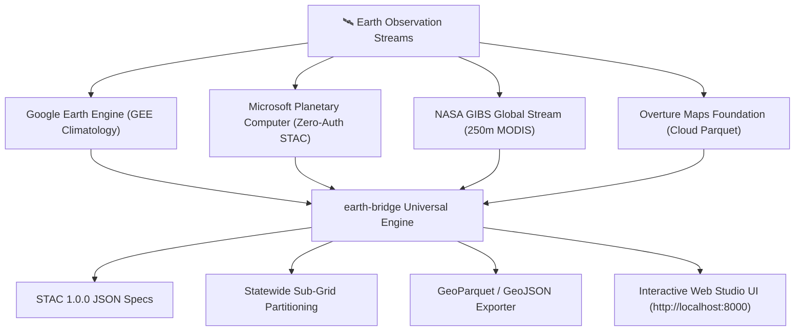

# 🌍 earth-bridge: Universal Spatial Intelligence Engine

[](https://pypi.org/project/earth-bridge/)
[](https://opensource.org/licenses/MIT)
[](https://python.org)
[](https://pypi.org/project/earth-bridge/)

> **Bridging Google Earth Engine, Microsoft Planetary Computer, and Overture Maps Foundation into a unified, zero-boilerplate Python SDK and Web GIS Studio.**

---

## ⚡ 1-Minute Quick Start (macOS, Linux, Windows)

### 1. Installation

Install the library directly from PyPI on any operating system:

```bash
pip install earth-bridge
```

### 2. Launch Interactive Studio (1 Command)

Open the visual GIS workbench directly in your default browser from anywhere:

```bash
earthbridge studio
```
*Or in Python:*
```python
import earthbridge as eb
eb.studio()
```

---

## 🐍 Python Keyword API

`earth-bridge` provides clean, intuitive top-level functions for spatial workflows with zero boilerplate:

```python
import earthbridge as eb

# 1. 🌲 Zero-Auth MODIS 250m Tree Canopy Cover & Vegetation
canopy = eb.get_modis_tcc(bbox=[78.0, 15.0, 80.0, 17.0])
print("Mean Canopy Cover:", canopy["stats"]["Percent_Tree_Cover_mean"], "%")

# 2. 🛰️ Zero-Auth STAC Search (Microsoft Planetary Computer)
scenes = eb.search_stac(bbox=[78.4, 17.3, 78.5, 17.4], collection="sentinel-2-l2a")
print(f"Found {len(scenes['items'])} satellite scenes")

# 3. 🏢 Fetch Building Footprints (Overture Maps via Cloud DuckDB)
buildings = eb.fetch_buildings(bbox=[78.4, 17.3, 78.5, 17.4], limit=500)

# 4. 🗺️ Memory-Safe Statewide Grid Partitioning
tiles = eb.partition(bbox=[76.0, 12.0, 85.0, 20.0], tile_size=0.1)
print(f"Partitioned into {len(tiles)} safe compute tiles")

# 5. 🌿 Compute Satellite Spectral Indices (NDVI, NDWI, LSWI, NBR, NDBI)
ndvi_data = eb.compute_index(bbox=[78.4, 17.3, 78.5, 17.4], index="ndvi")

# 6. 📦 1-Click Multi-Format Dataset Export
eb.export(buildings, format="geojson", output="enriched_buildings.geojson")
eb.export(buildings, format="parquet", output="enriched_buildings.parquet")

# 7. 📊 Generate Executive HTML Sustainability & Policy Report
eb.report(buildings, city_name="Hyderabad", output="policy_report.html")
```

---

## 🌟 Core Architecture & Features



### ✨ What makes `earth-bridge` unique:
- **🔓 Zero-Auth Public STAC & Tile Streaming**: Query Microsoft Planetary Computer & NASA GIBS without needing GCP accounts, AWS credentials, or API keys.
- **🌲 Statewide & Regional MODIS 250m Coverage**: Seamless continuous 250m vegetation and tree canopy cover across entire states without tile cutoffs.
- **✏️ Interactive Manual ROI Drawing**: Draw polygons and rectangles directly on the studio map with live bounding-box sync.
- **📁 Multi-Format Vector Uploads**: Drag-and-drop `.zip`, `.geojson`, `.shp` (with `.shx`/`.dbf`), `.gpkg`, or `.kml` boundaries with individual layer switches.
- **🏛️ DuckDB Zero-Copy Overture Joins**: Stream millions of building footprints straight from S3/Azure without downloading gigabytes of raw files.

---

## 🛠️ CLI Reference

```bash
# Launch interactive visual studio
earthbridge studio

# Compute spectral index from CLI
earthbridge index --type ndvi --band1 0.65 --band2 0.12

# Zero-Auth STAC search
earthbridge stac-search --bbox 78.4,17.3,78.5,17.4 --collection sentinel-2-l2a

# Partition large state bounding box
earthbridge partition --bbox 78.0,17.0,79.0,18.0 --tile-size 0.1
```

---

## 📄 License

Distributed under the **MIT License**. Open-source for developers, researchers, and geospatial engineers worldwide.

